# Gui Shape Library

A gui control library for creating polygons, stars, custom shapes, bitmaps, and 2D gradients.

This library contains:
- Geometric classes
  - Geometric coordinates for 2D (XY), and 3D (XYZ) planes
  - Geometric angle (radian and degree)
  - Geometric coordinate calculations for ellipse, circle, n-sided polygon, and n-point stars
  - Generation of straight and curved/rounded paths from geometric coordinates
  - Various geometric operations for calculating slopes, distance, intermediate points, centering, etc.
- GUI Shapes
  - N-sided polygon clipper and border
  - N-point star clipper and border
  - Polar graph-based clipper and border
  - Custom shape clipper and border
  - Generic clipper and border
- Gradient
  - 2-dimensional (2D) gradient
- Image
  - Bitmap file-format generator

Although there are other libraries that support regular shaped polygons (e.g. [polygon_clipper](https://pub.dev/packages/polygon_clipper) package by [leonardocaldas](https://github.com/leonardocaldas)), this library supports polygons shaped to fit their rectangular container using ellipse to calculate geometric points, and improve rounding of corners in polygons and stars.

## Installation

Add to your package's pubspec.yaml file:

```yaml
dependencies:
	gui_shape: ^1.0.1
```

## Usage

Import library in your dart file:

```dart
import 'package:gui_shape/gui_shape.dart';
```

## Examples

### N-Sided Polygon

Samples show n-sided polygons using **GuiClipShape**, and **GuiShapeBorder** with straight, rounded, stretched, and rotated properties.  Shape of polygon is defined by **GuiShapePolygon**.

<table><tr>
<td>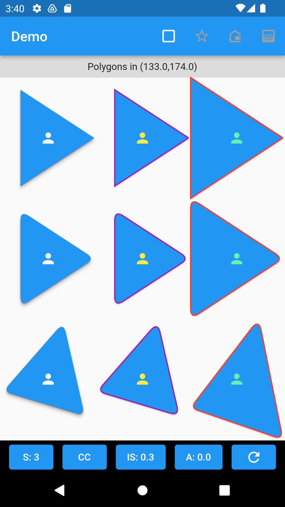</td>
<td>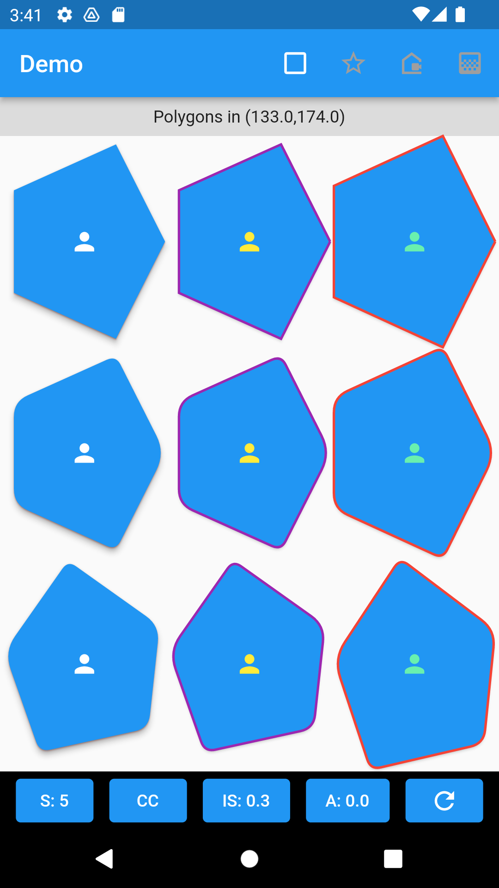</td>
<td>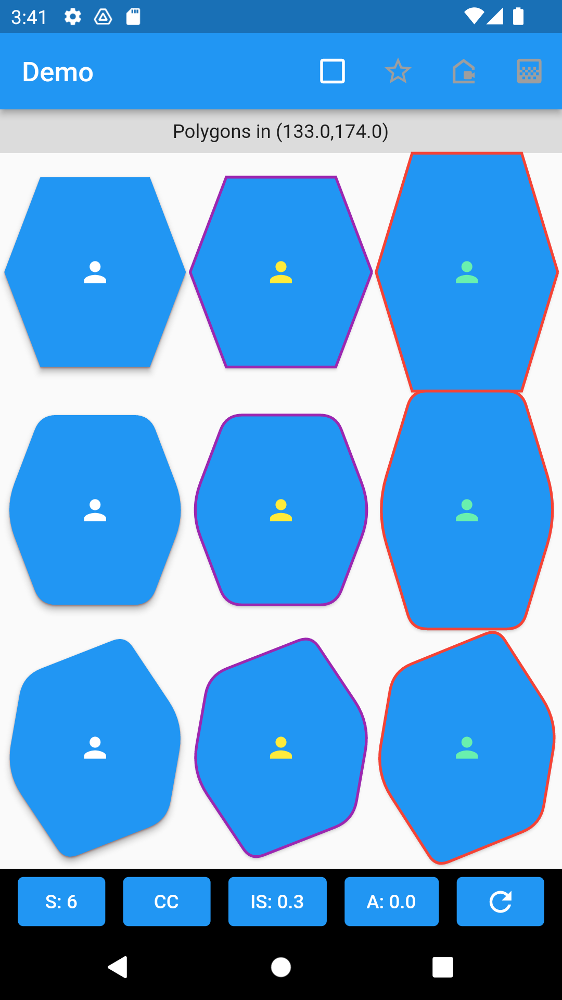</td>
</tr></table>

1) A 5-sided clip (pentagon shaped).

```dart
	GuiClipShape(
		shape: GuiShapePolygon(sides: 5, startAngle: GeoAngle.ZERO),
		child: Container(color: Colors.blue,),
	)
````

2) An elevated button w/ 5-sided border (pentagon shaped).

```dart
	ElevatedButton(
		style: ElevatedButton.styleFrom(
			shape: GuiShapeBorder(
				shape: GuiShapePolygon(sides: 5, startAngle: GeoAngle.ZERO),
				side: const BorderSide(color: Colors.purple,width: 2.0), 
			),
		),
		onPressed: () {},
		child: const Icon(Icons.person, color: Colors.yellow),
	)
````


3) A 5-sided clip (pentagon shaped), with rounded corners and fitted to container's dimensions.

```dart
	GuiClipShape(
		shape: GuiShapePolygon(
			sides: 5,
			cornerRadius: 8,
			startAngle: GeoAngle(degree: 0),
			clockwise: true,
			boxFit: BoxFit.fill,
		),
		shadows: [
			GuiShadow(color: Colors.red, elevation: 1.0),
			GuiShadow(color: Colors.grey, elevation: 4.0)
		],
		child: Container(
			color: Colors.blue,
				child: const Center(
					child: Icon(Icons.person, color: Colors.white),
				)
			),
		),
	)
````

4) An elevated button w/ 5-sided border (pentagon shaped), with rounded corners and fitted to container's dimensions.

```dart
	ElevatedButton(
		style: ElevatedButton.styleFrom(
			shape: GuiShapeBorder(
				shape: GuiShapePolygon(
					sides: 5,
					cornerRadius: 8,
					startAngle: GeoAngle(degree: 0),
					clockwise: true,
					boxFit: BoxFit.fill,
				),
				side: const BorderSide(
					color: Colors.purple,
					width: 2.0
				), 
			),
		),
		onPressed: () {},
		child: const Icon(Icons.person, color: Colors.yellow),
	)
````

### N-Pointed Stars

Samples show n-pointed stars using **GuiClipShape**, and **GuiShapeBorder** with straight, rounded, stretched, and rotated properties.  Shape of polygon is defined by **GuiShapeStar**.

<table><tr>
<td>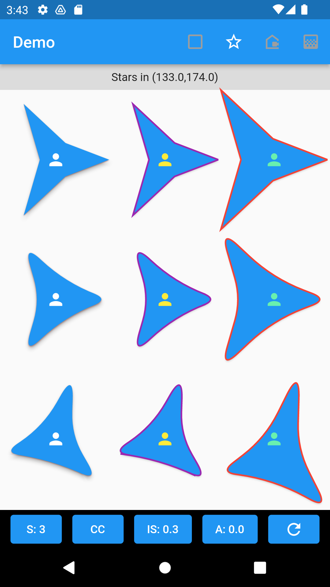</td>
<td>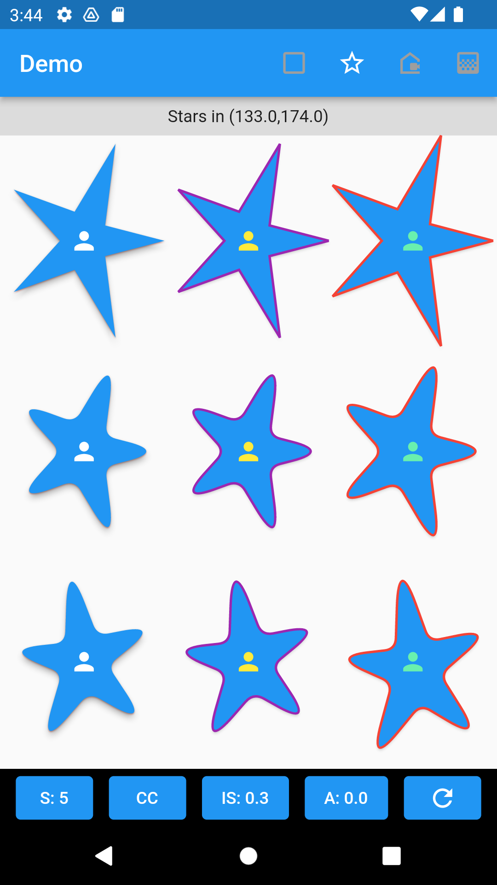</td>
<td>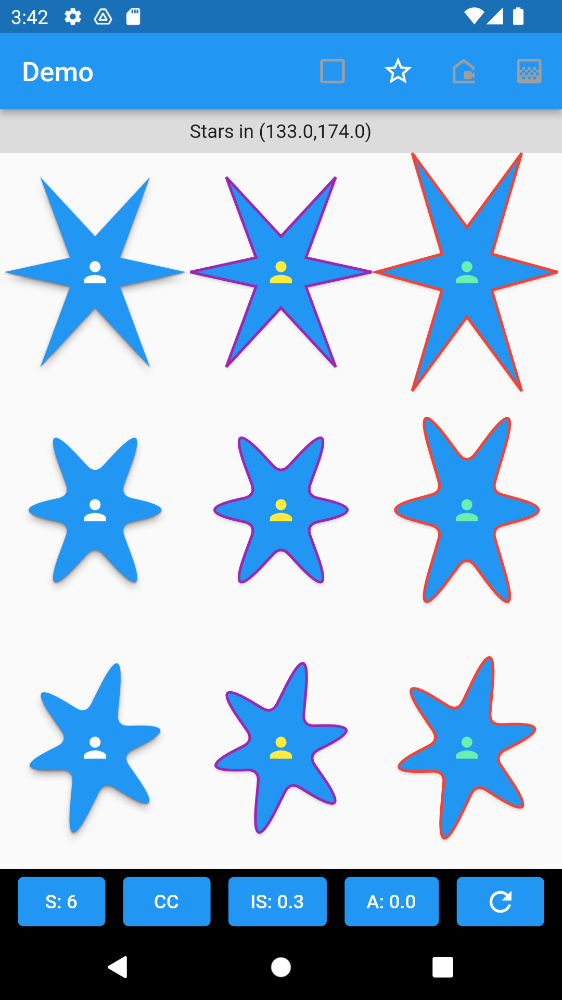</td>
</tr></table>

1) A 5-pointed star clip.

```dart
	GuiClipShape(
		shape: GuiShapeStar(sides: 5,startAngle: GeoAngle.ZERO),
		child: Container(color: Colors.blue)
	)
````

2) An elevated button w/ 5-pointed star border , with rounded corners and fitted to container's dimensions.

```dart
	ElevatedButton(
		style: ElevatedButton.styleFrom(
			shape: GuiShapeBorder(
				shape: GuiShapeStar(sides: 5, startAngle: GeoAngle.ZERO),
				side: const BorderSide(color: Colors.purple, width: 2.0)
			),
		),
		onPressed: () {},
		child: const Icon(Icons.person, color: Colors.yellow),
	)
````

3) A 5-pointed star clip with rounded corners and fitted to container's dimensions.

```dart
	GuiClipShape(
		shape: GuiShapeStar(
			sides: 5,
			cornerRadius: 8,
			startAngle: GeoAngle(degree: 0),
			clockwise: true,
			boxFit: BoxFit.fill,
			indentSideFactor: 0.3,
		),
		shadows: [
			GuiShadow(color: Colors.red, elevation: 1.0),
			GuiShadow(color: Colors.grey, elevation: 4.0)
		],
		child: Container(
			color: Colors.blue,
			child: const Center(
				child: Icon(Icons.person, color: Colors.white),
			)
		),
	)
````

4) An elevated button w/ 5-pointed star border , with rounded corners and fitted to container's dimensions.

```dart
	ElevatedButton(
		style: ElevatedButton.styleFrom(
			shape: GuiShapeBorder(
				shape: GuiShapeStar(
					sides: 5,
					cornerRadius: 8,
					startAngle: GeoAngle(degree: 0),
					clockwise: true,
					boxFit: BoxFit.fill,
					indentSideFactor: 0.3,
				),
				side: const BorderSide(
					color: Colors.purple,
					width: 2.0
				), 
			),
		),
		onPressed: () {},
		child: const Icon(Icons.person, color: Colors.yellow),
	)
````

### Polar Shapes 

Samples show polar shapes rendered by a function that sweeps 360 degrees (default).  Shape of a polar graph is defined by **GuiShapePolar** and may be used with **GuiClipShape** to clip a region, or **GuiShapeBorder** to create an outline.

<table><tr>
<td>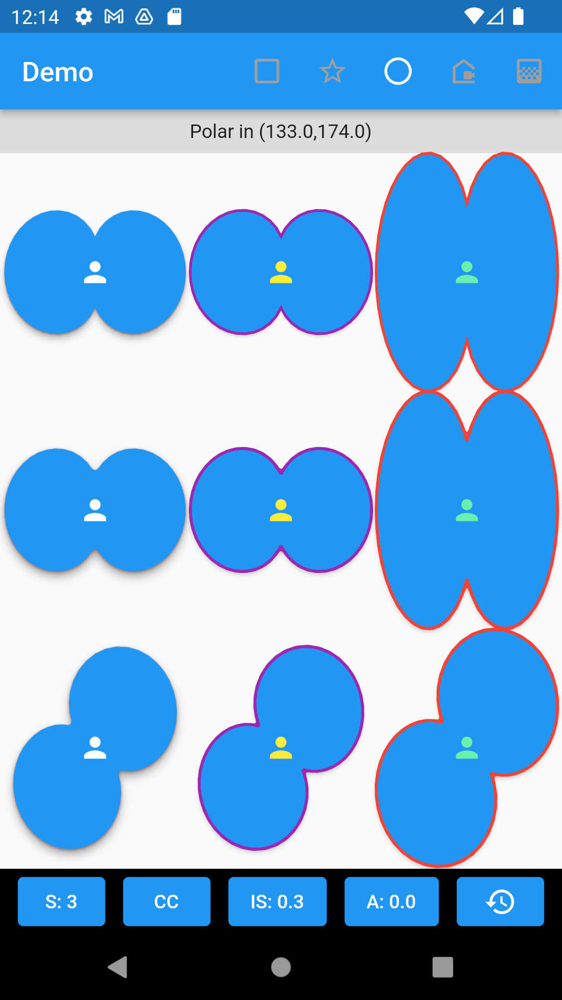</td>
<td>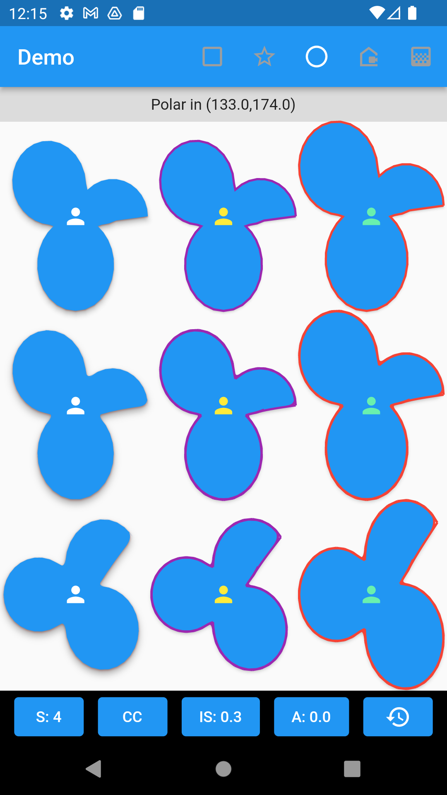</td>
<td>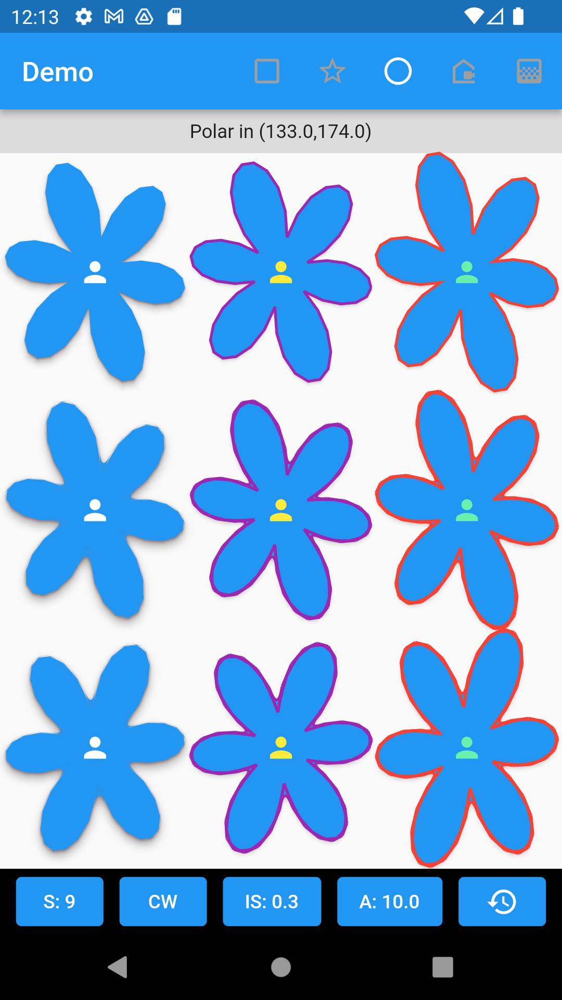</td>
</tr></table>

1) A user-defined polar function-based clip 

```dart
	GuiClipShape(
		shape: GuiShapePolar(
			formula: (GeoAngle angle) {
				return 0.7 * cos(3 * angle.radian).abs() + 0.3;
			}
		),
		child: Container(color: Colors.blue)
	)
````

2) A user-defined polar function-based elevated button 

```dart
	ElevatedButton(
		style: ElevatedButton.styleFrom(
			shape: GuiShapePolar(
				formula: (GeoAngle angle) {
					return 0.7 * cos(3 * angle.radian).abs() + 0.3;
				}
			),
		),
		onPressed: () {},
		child: const Icon(Icons.person, color: Colors.yellow),
	)
````

3) A four-leaf clover polar shape clip region 

```dart
	GuiClipShape(
		shape: GuiShapePolar(
			formula: (GeoAngle angle) {
				return 0.7 * cos(2 * angle.radian).abs() + 0.3;
			},
			sampling: 60,
			polarBeginAngle: GeoAngle.zero.radian,		// default
			polarEndAngle: GeoAngle.angle360.radian,	// default 
			cornerRadius: 0,
			startAngle: GeoAngle(degree: 45),
			clockwise: true,
			boxFit: BoxFit.none,
		),
		shadows: const [
			GuiShadow(color: Colors.red, elevation: 1.0),
			GuiShadow(color: Colors.grey, elevation: 4.0)
		],
		child: Container(
			color: Colors.blue,
			child: const Center(
				child: Icon(Icons.person, color: Colors.white),
			)
		),
	)
````

4) A four-leaf clover polar shape elevated button

```dart
	ElevatedButton(
		style: ElevatedButton.styleFrom(
			shape: GuiShapeBorder(
				shape: GuiShapePolar(
					formula: (GeoAngle angle) {
						return 0.7 * cos(2 * angle.radian).abs() + 0.3;
					},
					sampling: 60,
					cornerRadius: 0,
					startAngle: GeoAngle.zero,
					clockwise: true,
					boxFit: BoxFit.fill,
				),
				side: const BorderSide(
					color: Colors.purple,
					width: 2.0
				),
			),
		),
		onPressed: () {},
		child: const Icon(Icons.person, color: Colors.yellow),
	)
````

### Custom Polygon

Samples show a custom polygon using **GuiClipShape**, and **GuiShapeBorder** with straight, rounded, stretched, and rotated properties.  Shape of polygon is defined by **GuiShapeCustom**.  Each point is defined by **GeoCoordinate2D**. 

<table><tr>
<td>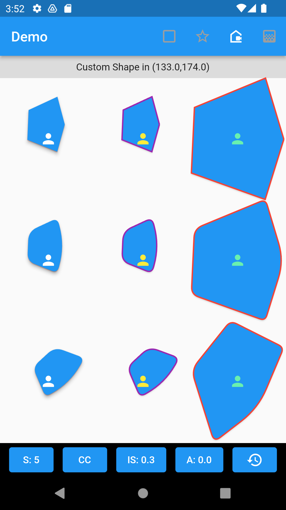</td>
<td>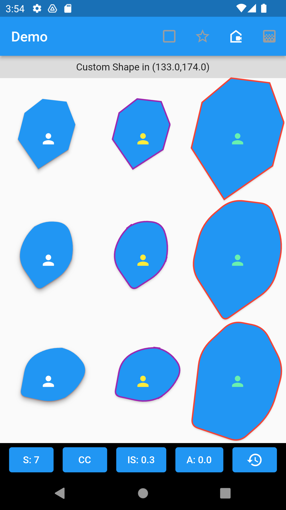</td>
</tr></table>

1) A custom shaped clip with rounded corners and fitted to container's dimensions.

```dart
	GuiClipShape(
		shape: GuiShapeCustom(
			points: [
				GeoCoordinate2D( x1, y1 ),
				GeoCoordinate2D( x2, y2 ),
				GeoCoordinate2D( x3, y3 ),
				GeoCoordinate2D( x4, y4 ),
				GeoCoordinate2D( x5, y5 ),
			],
			cornerRadius: 8,
			rotate: GeoAngle.ZERO,
			boxFit: BoxFit.fill,
		),
		shadows: [
			GuiShadow(color: Colors.red, elevation: 1.0),
			GuiShadow(color: Colors.grey, elevation: 4.0)
		],
		child: Container(
			color: Colors.blue,
			child: const Center(
				child: Icon(Icons.person, color: Colors.white),
			)
		),
	)
````

2) An elevated button w/ custom shape border, rounded corners and fitted to container's dimensions.

```dart
	ElevatedButton(
		style: ElevatedButton.styleFrom(
			shape: GuiShapeBorder(
				shape: GuiShapeCustom(
					points: [
						GeoCoordinate2D( x1, y1 ),
						GeoCoordinate2D( x2, y2 ),
						GeoCoordinate2D( x3, y3 ),
						GeoCoordinate2D( x4, y4 ),
						GeoCoordinate2D( x5, y5 ),
					],
					cornerRadius: 8,
					rotate: GeoAngle.ZERO,
                    clockwise: true,
					boxFit: BoxFit.fill,
				),
				side: const BorderSide(
					color: Colors.purple,
					width: 2.0
				), 
			),
		),
		onPressed: () {},
		child: const Icon(Icons.person, color: Colors.yellow),
	)
````


### 2-Dimensional Custom Gradient

Samples show a custom gradient using **GuiNormalizeGradient**.  A map of stops, along with list of colors are provided in a 2-dimensional.  Each color is represented with it's stop location using **GuiGradientColor**. The normalized gradient will automatically compute stops within the range 0.0 (0%) and 1.0 (100%) (in cases stops with associated color are outside the rendering range).  The operation createImage() creates a bitmap image of the gradient with the specified dimensions for stops within the 0.0 and 1.0 range (both horizontally and vertically).

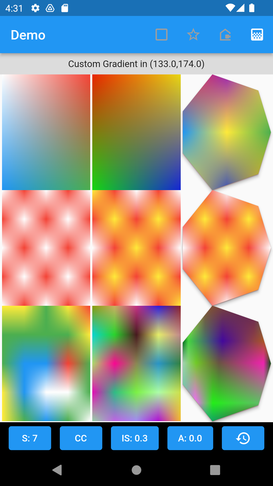

1) A simple 100x200 gradient image with top left white, top right red, bottom left blue, and bottom right green.

```dart
	GuiNormalizeGradient({
		0.0: <GuiGradientColor>[
				GuiGradientColor(Colors.white,0.0), 
				GuiGradientColor(Colors.red, 1.0) 
			],
		1.0: <GuiGradientColor>[
				GuiGradientColor(Colors.blue,0.0), 
				GuiGradientColor(Colors.green, 1.0) 
			],
	})
	.createImage(100, 200)
````

2) A 200x200 red and white checkered gradient image.

```dart
	GuiNormalizeGradient({
		0.0: <GuiGradientColor>[
			GuiGradientColor(Colors.white,0.0), 
			GuiGradientColor(Colors.red, 0.25), 
			GuiGradientColor(Colors.white, 0.5), 
			GuiGradientColor(Colors.red, 0.75), 
			GuiGradientColor(Colors.white, 1.0) 
		],
		0.25: <GuiGradientColor>[
			GuiGradientColor(Colors.red,0.0),
			GuiGradientColor(Colors.white, 0.25),
			GuiGradientColor(Colors.red, 0.5),
			GuiGradientColor(Colors.white, 0.75),
			GuiGradientColor(Colors.red, 1.0)
		],
		0.5: <GuiGradientColor>[
			GuiGradientColor(Colors.white,0.0),
			GuiGradientColor(Colors.red, 0.25),
			GuiGradientColor(Colors.white, 0.5),
			GuiGradientColor(Colors.red, 0.75),
			GuiGradientColor(Colors.white, 1.0)
		],
		0.75: <GuiGradientColor>[
			GuiGradientColor(Colors.red,0.0), 
			GuiGradientColor(Colors.white, 0.25), 
			GuiGradientColor(Colors.red, 0.5), 
			GuiGradientColor(Colors.white, 0.75), 
			GuiGradientColor(Colors.red, 1.0) 
		],
		1.0: <GuiGradientColor>[
			GuiGradientColor(Colors.white,0.0), 
			GuiGradientColor(Colors.red, 0.25), 
			GuiGradientColor(Colors.white, 0.5), 
			GuiGradientColor(Colors.red, 0.75), 
			GuiGradientColor(Colors.white, 1.0) 
		],
	}).createImage(200, 200)

````

### Geometric Classes

Supporting classes aid in performing computations, and rendering shapes and images.

* List of classes
  * **GeoCoordinate** - Defines a coordinate (x,y,z) in 3D space.  Supports operations to calculate distance, lerp, etc.
  * **GeoCoordinate2D** - Defines a coordinate (x,y) in 2D plane (z=0 implied).  Supports operations to calculate slope, distance, rotation, lerp, etc.
  * **GeoAngle** - An angle (represented by either radian or degrees).  Supports arithmetic operators.
  * **GeoEllipse** - Calculates coordinates on an ellipse at an angle.  The basis for calculating points of a polygon, and star encapsulated in a rectangular drawing area.
  * **GeoCircle** - Calculates coordinates on a circle at an angle.
  * **GeoCustom** - Helper class for storing user-defined coordinates, and generating a straight or curved Path.
  * **GeoPolygon** - Helper class for generating coordinates for a n-sided polygon, and generating a straight or curved Path.
  * **GeoStar** - Helper class for generating coordinates for a n-pointed star, and generating a straight or curved Path.
  * **GeoUtility** - Helper class for manipulating coordinates (ie. re-centering, resetting  origin, scaling, etc.)

### Gui Shape Classes

Classes aid in clipping regions or creating borders based on a shape.

* List of classes
  * **GuiClipShape** - A stateless widget for clipping a child widget in a user-defined shape
  * **GuiShapeBorder** - A stateless widget for creating an outlined border in a user-defined shape
  * **GuiShapePolygon** - A n-sided polygon shape
  * **GuiShapeStar** - A n-pointed star shape
  * **GuiShapePolar** - A polar function-based shape
  * **GuiShapeCustom** - A custom shape defined by a list of coordinates
  * **IGuiShape** - A shape interface for implementing additional shapes.  Used by GuiClipShape and GuiShapeBorder.

### Gradient Classes

Classes aid in creating 2-D color maps and rendering gradients as images.

* List of classes
  * **GuiGradientColor** - A color and stop position in a gradient
  * **GuiNormalizeGradient** - A 2-dimensional normalized gradient with colors and stops in both x and y axis._
  * **GuiGradientImage** - A helper class that converts GuiNormalizeGradient into a Flutter Image widget._

### Image Classes

Classes aid creating image buffers based on raw color pixel data.

* List of classes
  * **GuiBitmapBuffer** - A class that prepares an image in BMP format, with BMP header populated.  The user can populate the bitmap image data and use the resulting array to either load the Image (via Image.memory(…)) or store the resulting BMP data into an I/O stream (ie. file, network, etc…

 ## Issues
 
 If you encounter any issues, please report them at [https://github.com/itusn/gui_shape/issues](https://github.com/itusn/gui_shape/issues).
 
 